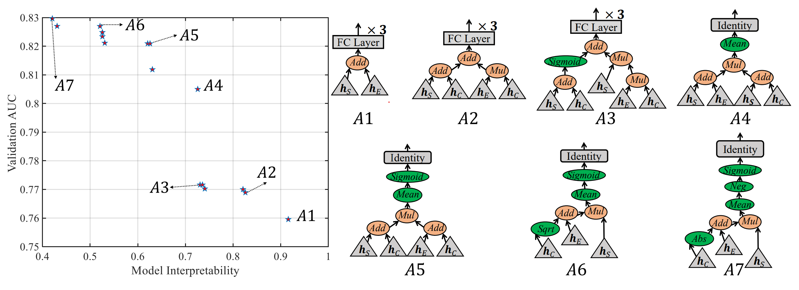
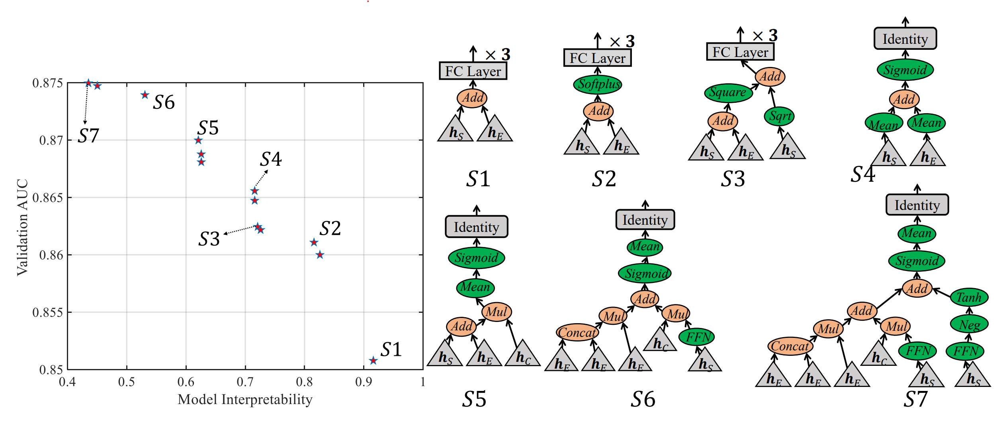
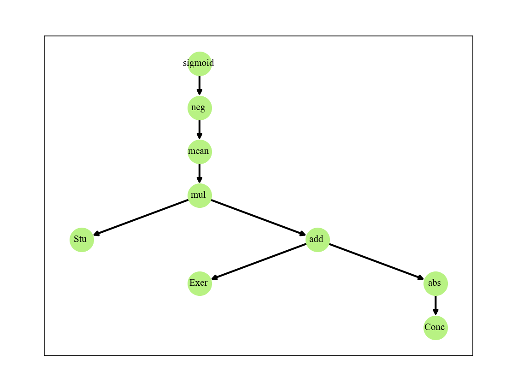

# EMO-NSA-CD

## Introduction

This is the source code of the paper entitled [**An Evolutionary Multi-Objective Neural Architecture Search Approach to Advancing Cognitive Diagnosis in Intelligent Education**](https://ieeexplore.ieee.org/abstract/document/10599558/). 
 This is also the code of [*Designing Novel Cognitive Diagnosis Models via Evolutionary Multi-Objective Neural Architecture Search*](https://arxiv.org/abs/2307.04429). You can also find the old version at [here](https://github.com/DevilYangS/EMO-NAS-CD/tree/main/Old%20Version).


## Dependency Install
To start with, you may install some packages to meet the dependency as 
1. Create your environment by conda
   ```
   conda create envname python=3.9
   ```
2.  install dependency by
   ```
pip install -r requirements.txt
   ```
**or** manually install the following packages
```
pytorch>=1.4.0
scikit-learn
pandas
networkx # used for plotting neural architectures
```


## Prepare Datasets
- Process your target dataset or Download datasets from [EduData](https://github.com/bigdata-ustc/EduData). This repository provides five datasets, including ASSIST09 (termed assist), SLP, ASSIST12, ASSIST2017, and Junyi. 
- Current dir has contained three datasets: ASSIST09, SLP, and Junyi. Complete datasets can be found at the [release](https://github.com/DevilYangS/EMO-NAS-CD/releases/tag/datasets).
- Then you can run the *divide_data.py* to get the variant datasets under different splitting ratios as
  ```
   divide_data(name='slp',ratio=0.6) # ratio from 0.4 to 0.7
  ```
  That will generate the train/validation/test datasets for SLP under the ratio of 0.6/0.1/0.3.
  You can generate others by setting ratio to from 0.4 to 0.7 for ASSIST09 and Junyi.

- For ASSIST12 and ASSIST17, only the datasets under ratio of 0.7 is needed, but you can also run the *Re_divide_data_for_12_2017.py* to re-divide the dataset as
  ```
   redivide_data(name='assist12',ratio=0.6) 
  ```
   That will generate the train/validation/test datasets for ASSIST12 under the ratio of 0.6/0.1/0.3.


## Directly Use the Found Models by EMO-NSA-CD and Others

You can directly use the found models by EMO-NAS-CD on ASSISTments2009 and SLP datasets. Their searching logs can be found at `./experiment/AssistmentSearch_22-07-08_18-11-39/` and `./experiment/slpSearch_22-08-16_23-07-02`, respectively. 

The non-dominated individuals/models can be extracted from  `Gen_99/fitness.txt` and `Gen_99/Population.txt`  as follows:
```
from EMO_public import NDsort
import numpy as np

fitness =np.loadtext(`Gen_99/fitness.txt`)
Popsize=fitness.shape[0]
FrontValue = NDsort.NDSort(fitness, Popsize)[0]

nondominated_individuals = np.where(FrontValue==0)[0]+1

```
The Pareto front and seven selected models (on two datasets) are  shown as follows

 

Here *A1-A7* were found on the  **ASSISTments2009 dataset**, *S1-S7* were found on the  **SLP dataset**. 
For *A1-A7*, their `nondominated_individuals` is **[2,37,15,25,98,73,82]**, while for *S1-S7*, their `nondominated_individuals` is [3,6,29,18,12,41,57].
In short, A1_A7= [2,37,15,25,98,73,82], S1_S7=[3,6,29,18,12,41,57]. 

With  the `nondominated_individuals` index, you can extract their decision variables from `Gen_99/Population.txt`.

To save these models conveniently, each model is saved with integer encoding. 
That is, the integer encoding （three-bit for illustrating one node）, where the first and second bits denote that the node receives which input, and the third bit specifies that the node adopts which operation in ``Models/Operations``.
For example, [0,1,10] denotes the node takes the *student* and 'exercise' as inputs and uses the `Add` operation.  

Their integer encoding is as follows:
```
DECSPACE = []
# A1-A7
DECSPACE.append( [0, 1, 10] )
DECSPACE.append([0, 2, 10, 1, 2, 11, 3, 4, 10] )
DECSPACE.append([1, 2, 10, 3, 0, 6, 0, 2, 11, 0, 5, 11, 4, 6, 10] )
DECSPACE.append([0, 1, 10, 0, 2, 10, 3, 4, 11, 5, 0, 13] )
DECSPACE.append([1, 2, 10, 0, 2, 10, 3, 4, 11, 5, 0, 13, 6, 0, 6] )
DECSPACE.append([2, 0, 3, 1, 3, 10, 0, 4, 11, 5, 0, 13, 6, 0, 6] )
DECSPACE.append( [2, 0, 1, 1, 3, 10, 0, 4, 11, 5, 0, 13, 6, 0, 0, 7, 0, 6] )

# S1-S7
DECSPACE.append([0, 1, 10]  )
DECSPACE.append(  [0, 1, 10, 3, 0, 7] )
DECSPACE.append(  [0, 1, 10, 3, 0, 2, 0, 0, 3, 4, 5, 10] )
DECSPACE.append( [1, 0, 13, 0, 0, 13, 3, 4, 10, 5, 0, 6] )
DECSPACE.append( [0, 1, 10, 2, 3, 11, 4, 0, 13, 5, 0, 6] )
DECSPACE.append( [1, 1, 12, 1, 3, 11, 0, 0, 9, 5, 2, 11, 4, 6, 10, 7, 0, 6, 8, 0, 13] )
DECSPACE.append( [1, 1, 12, 1, 3, 11, 0, 0, 9, 5, 2, 11, 4, 6, 10, 0, 0, 9, 8, 0, 0, 9, 0, 4, 7, 10, 10, 11, 0, 6, 12, 0, 13] )
```

With their encodings, you can visualize their architectures by creating and running the following script:
```
   from EvolutionSearch import Individual as Individual
   from genotypes import Genotype_mapping
    I1 = Individual(Dec=[1, 1, 12, 1, 3, 11, 0, 0, 9, 5, 2, 11, 4, 6, 10, 7, 0, 6, 8, 0, 13]  ,mapping=Genotype_mapping )
    I1.visualization()
```
Then you can get the following plotting.


**Or** You can use the `Models/Plotting.py` to plot the architecture  as
```
   from Models.Plotting import Individual
   from genotypes import Genotype_mapping
   I1 = Individual(Dec=[2, 0, 1, 1, 3, 10, 0, 4, 11, 5, 0, 13, 6, 0, 0, 7, 0, 6]  ,mapping=Genotype_mapping )
   I1.visualization()
```
Then you can get the following plotting.


After that, you can directly  run the `main.py` to train these models and get their results.

**Note that** `main.py` has contained the models of *A1-A7* and *S1-S7*, where the models of *fA1-fA7* and *fS1-fS7* found by EMO-NSA-CD(flops) i.e., `EvolutionarySearch_FLOPs.py` are also included. Besides, the models found by AZ, MOAZ, and *RandomSearch* are also included as follows:
```

#fA1-fA7
# DECSPACE = []
# DECSPACE.append([0, 1, 8])
# DECSPACE.append( [0, 0, 13, 3, 0, 1] )
# DECSPACE.append( [1, 0, 13, 3, 0, 7, 4, 0, 3, 5, 0, 4, 6, 0, 1, 7, 0, 0, 8, 0, 1]  )
# DECSPACE.append(  [0, 1, 10, 3, 0, 13, 4, 0, 0] )
# DECSPACE.append(  [0, 1, 11, 3, 0, 13, 4, 0, 0, 5, 0, 6, 6, 0, 2] )
# DECSPACE.append( [1, 2, 10, 0, 3, 11, 4, 0, 13, 5, 0, 6, 6, 0, 0, 7, 0, 2]  )
# # DECSPACE.append( [1, 0, 13, 3, 0, 0, 4, 0, 7, 5, 0, 0, 6, 0, 3, 7, 0, 0, 8, 0, 4, 9, 0, 1]  )
# DECSPACE.append(  [2, 0, 1, 1, 3, 10, 0, 4, 11, 5, 0, 13, 6, 0, 0, 7, 0, 7, 8, 0, 6, 9, 0, 0, 10, 0, 1, 11, 0, 2] )

#fS1-fS7
# DECSPACE.append([0, 1, 13])
# DECSPACE.append([0, 0, 13, 3, 0, 1] )
# DECSPACE.append([0, 0, 13, 3, 0, 3, 4, 0, 4, 5, 0, 0, 6, 0, 7, 7, 0, 2] )
# DECSPACE.append([0, 0, 8, 3, 0, 0, 1, 0, 8, 4, 5, 10, 6, 0, 6] )
# DECSPACE.append([1, 0, 13, 0, 0, 13, 3, 4, 10, 5, 0, 0, 6, 0, 7, 7, 0, 0, 8, 0, 2, 9, 0, 4] )
# DECSPACE.append([1, 0, 9, 0, 0, 9, 3, 4, 10, 1, 0, 13, 6, 0, 3, 7, 0, 1, 5, 8, 11, 9, 0, 6, 10, 0, 1] )
# DECSPACE.append([1, 0, 9, 3, 0, 3, 0, 0, 9, 5, 0, 3, 4, 6, 10, 7, 0, 0, 1, 0, 13, 9, 0, 3, 10, 0, 4, 11, 0, 1, 8, 12, 11, 13, 0, 6] )

#--------------------------------------------------------------------------------------------------------------------------------------------


# #  Random Search, AZ, MOAZ
# DECSPACE = []


# DECSPACE.append( [1, 0, 7, 0, 2, 10, 3, 4, 11, 5, 0, 13]  ) # Random Search : 28

# DECSPACE.append( [1, 2, 11, 3, 0, 1, 0, 4, 10, 5, 0, 2, 6, 0, 4, 7, 0, 1, 8, 0, 7, 9, 0, 3, 10, 0, 1, 11, 2, 10,
#                   12, 0, 0, 13, 0, 6, 14, 0, 5, 1, 15, 11, 16, 0, 2, 0, 17, 10, 18, 0, 8, 19, 2, 10, 20, 0, 6, 1,
#                   21, 10, 22, 0, 4, 23, 0, 2, 24, 0, 13, 1, 25, 10, 26, 0, 2, 27, 0, 4, 28, 0, 9, 29, 0, 3, 30, 2,
#                   10, 31, 0, 7, 32, 0, 5, 33, 0, 1, 1, 34, 10, 1, 35, 11, 2, 36, 12, 37, 0, 9, 0, 38, 11, 39, 0, 6,
#                   40, 0, 2, 0, 41, 11, 0, 42, 11, 43, 2, 11, 44, 0, 3, 45, 0, 7, 46, 0, 5, 2, 47, 11, 48, 0, 1, 49, 0,
#                   7, 50, 0, 5, 51, 0, 2, 1, 52, 10, 53, 0, 5, 54, 0, 3, 55, 0, 5, 56, 2, 11, 57, 0, 0, 58, 0, 4, 59, 0,
#                   1, 1, 60, 12, 61, 0, 4, 62, 2, 12, 63, 0, 6, 64, 0, 4, 65, 0, 13, 2, 66, 11, 67, 0, 8, 2, 68, 11]   ) # AZ[8026] : 93

# DECSPACE.append( [0, 1, 10, 3, 0, 7, 4, 0, 6, 0, 5, 11, 6, 0, 4, 7, 0, 13, 8, 0, 6, 9, 2, 11, 1, 10, 10, 0, 11, 11, 12, 0, 13,
#                   13, 0, 6, 14, 0, 7, 15, 0, 6, 1, 16, 11, 0, 17, 12, 18, 0, 7, 19, 0, 13, 1, 20, 10, 0, 21, 11, 22, 0, 13, 23,
#                   0, 6, 24, 0, 4, 1, 25, 10, 0, 26, 10, 0, 27, 11, 28, 0, 13, 29, 0, 6, 0, 30, 11, 31, 0, 0, 32, 0, 4, 33, 0, 7,
#                   34, 0, 4, 35, 0, 1, 2, 36, 11, 37, 0, 6, 38, 0, 7, 39, 0, 13, 40, 2, 11, 1, 41, 10, 0, 42, 11, 43, 0, 13, 44, 0,
#                   6, 45, 0, 7, 46, 0, 0, 47, 0, 6, 48, 0, 2, 49, 0, 6, 50, 0, 7, 51, 0, 6, 1, 52, 11, 53, 0, 6, 54, 0, 7, 55, 0, 13,
#                   56, 0, 0, 1, 57, 10, 0, 58, 11, 59, 0, 13, 60, 0, 6, 61, 0, 0, 62, 0, 4, 1, 63, 10, 64, 0, 8, 65, 0, 0, 66, 0, 4,
#                   67, 0, 6, 68, 0, 7, 69, 0, 3, 70, 0, 6, 71, 0, 7, 72, 0, 4, 1, 73, 10, 74, 0, 6, 75, 0, 2, 0, 76, 11, 77, 0, 13, 78,
#                   0, 6, 79, 0, 0, 80, 0, 1, 81, 0, 4, 0, 82, 11, 83, 0, 0, 84, 0, 7, 85, 0, 6, 1, 86, 11, 87, 0, 13, 88, 0, 6, 89, 0,
#                   7, 90, 0, 1, 1, 91, 10, 0, 92, 11, 93, 0, 13, 94, 0, 6, 95, 0, 2, 96, 0, 1, 97, 0, 6, 98, 0, 4, 1, 99, 10, 0, 100,
#                   11, 101, 0, 13, 102, 0, 6, 103, 0, 1, 104, 2, 10, 105, 0, 4, 106, 0, 6, 107, 0, 0, 108, 0, 7, 109, 0, 13, 0, 110, 11,
#                   0, 111, 11, 112, 0, 1, 113, 0, 6, 2, 114, 10, 115, 2, 10, 116, 0, 6, 0, 117, 11, 118, 0, 13, 1, 119, 10, 0, 120, 11,
#                   121, 0, 4, 122, 0, 13, 123, 0, 6, 124, 0, 2, 125, 0, 6, 126, 0, 0, 127, 0, 2, 0, 128, 10, 129, 0, 6, 1, 130, 11, 131,
#                   0, 8, 132, 0, 6, 133, 0, 7, 134, 0, 4, 1, 135, 10, 136, 0, 6, 1, 137, 11, 138, 0, 2, 139, 0, 1, 2, 140, 11, 141,
#                   0, 0, 142, 0, 6, 143, 0, 4, 144, 0, 7, 145, 0, 4, 146, 0, 7, 147, 0, 6, 1, 148, 11, 149, 0, 6, 150, 0, 7, 151, 0,
#                   13, 1, 152, 10, 0, 153, 11, 154, 0, 13, 155, 0, 6, 156, 0, 1, 157, 0, 2, 158, 0, 1, 159, 0, 2, 2, 160, 11, 161,
#                   0, 0, 162, 0, 4, 163, 0, 7, 164, 0, 0, 165, 0, 6, 166, 0, 1, 167, 0, 0, 168, 0, 6, 169, 0, 7, 170, 0, 6, 2, 171,
#                   11, 172, 0, 6, 1, 173, 10, 0, 174, 11, 175, 0, 13, 176, 0, 6, 177, 0, 0, 178, 0, 4, 179, 0, 1, 180, 0, 6, 181,
#                   0, 4, 2, 182, 11, 183, 0, 5, 184, 0, 7]  ) # MOAZ[74] : 93  MOAZ-1

# DECSPACE.append( [0, 0, 0, 3, 0, 13, 1, 4, 11, 5, 0, 13, 6, 0, 6, 7, 0, 7, 8, 0, 1, 1, 9, 10, 0, 10, 11, 11, 0, 13, 12,
#                   0, 6, 13, 0, 2, 14, 0, 1, 15, 0, 6, 1, 16, 11, 17, 0, 6, 0, 18, 11, 19, 0, 13, 20, 0, 6, 21, 0, 1, 22,
#                   0, 7, 23, 0, 6, 1, 24, 10, 0, 25, 11, 26, 0, 13, 27, 0, 6, 28, 2, 11, 1, 29, 10, 0, 30, 11, 31, 0, 0, 32,
#                   0, 7, 33, 0, 6, 1, 34, 11, 35, 0, 13, 36, 0, 6, 37, 0, 7, 38, 0, 1, 1, 39, 10, 0, 40, 11, 41, 0, 13, 42, 0,
#                   6, 43, 0, 2, 44, 0, 1, 45, 0, 6, 46, 0, 4, 1, 47, 10, 0, 48, 11, 49, 0, 13, 50, 0, 6, 51, 0, 1, 52, 2, 10, 53,
#                   0, 4, 54, 0, 1, 55, 0, 6, 56, 0, 0, 57, 0, 7, 58, 0, 13, 0, 59, 11, 0, 60, 11, 61, 0, 1, 62, 0, 6, 2, 63, 10, 64,
#                   2, 10, 65, 0, 6, 0, 66, 11, 67, 0, 13, 1, 68, 10, 0, 69, 11, 70, 0, 4, 71, 0, 13, 72, 0, 6, 73, 0, 2, 74, 0, 6, 75,
#                   0, 0, 1, 76, 11, 77, 0, 13, 78, 0, 6, 79, 0, 7, 80, 0, 1, 1, 81, 10, 0, 82, 11, 83, 0, 13, 84, 0, 6, 85, 0, 2, 86,
#                   0, 1, 87, 0, 6, 88, 0, 4, 1, 89, 10, 0, 90, 11, 91, 0, 13, 92, 0, 6, 93, 0, 1, 94, 2, 10, 95, 0, 4, 96, 0, 6, 97,
#                   0, 0, 98, 0, 7, 99, 0, 13, 100, 0, 7, 101, 0, 3, 102, 0, 0, 1, 103, 10, 0, 104, 11, 105, 0, 13, 106, 0, 6, 107, 0,
#                   0, 108, 0, 4, 1, 109, 10, 110, 0, 6, 111, 0, 0, 112, 0, 4, 113, 0, 1, 2, 114, 11, 115, 0, 4, 116, 2, 11]   ) # MOAZ[74] : 98 MOAZ-2
#
#
#
#
#
#
# DECSPACE.append( [1, 0, 9, 0, 0, 9, 3, 4, 10, 5, 0, 6]  ) # Random Search : 18
# DECSPACE.append( [0, 1, 10, 3, 2, 12, 4, 0, 0, 1, 5, 11, 6, 0, 7, 7, 0, 13, 8, 0, 5, 9, 0, 3, 10, 0, 5, 0, 11,
#                   10, 12, 0, 4, 13, 0, 13, 14, 0, 0, 15, 0, 7, 16, 0, 6, 17, 0, 5, 18, 2, 10, 19, 0, 13, 0, 20,
#                   10, 21, 0, 13, 22, 0, 7, 23, 0, 2, 24, 0, 7, 1, 25, 10, 1, 26, 11, 1, 27, 11, 28, 0, 2, 29, 0,
#                   13, 30, 0, 5, 1, 31, 11, 1, 32, 11, 33, 0, 13, 1, 34, 11, 35, 0, 7, 1, 36, 10, 37, 0, 6, 38, 0,
#                   5, 39, 0, 4, 40, 0, 5, 41, 0, 6, 1, 42, 10, 43, 2, 12, 0, 44, 10, 45, 0, 1, 46, 2, 12, 47, 0, 1,
#                   48, 0, 2, 49, 0, 0, 50, 0, 2, 51, 0, 0, 52, 0, 5, 1, 53, 10, 2, 54, 12, 55, 0, 5, 56, 0, 4, 57, 0,
#                   1, 58, 0, 4, 59, 0, 1, 1, 60, 10, 61, 0, 0, 62, 0, 9, 63, 0, 1, 64, 0, 5, 2, 65, 10, 66, 0, 9, 67,
#                   0, 2, 68, 0, 0, 69, 0, 4, 2, 70, 11, 0, 71, 11, 72, 0, 1, 73, 0, 2, 74, 0, 8, 75, 0, 3, 2, 76, 11,
#                   77, 0, 8, 78, 0, 7, 0, 79, 11, 80, 0, 6, 81, 0, 7, 82, 0, 1, 1, 83, 10]    ) # AZ : 23

# DECSPACE.append( [0, 1, 11, 3, 0, 1, 4, 0, 6, 5, 0, 1, 6, 0, 7, 7, 0, 4, 8, 0, 2, 9, 0, 4, 10, 0, 9, 11, 0, 0, 12,
#                   0, 7, 13, 0, 4, 0, 14, 11, 15, 0, 0, 16, 0, 2, 17, 0, 7, 18, 0, 4, 19, 0, 9, 20, 0, 7, 21, 0, 4,
#                   22, 0, 2, 0, 23, 10, 24, 0, 7]   ) # MOAZ : 2, MOAZ-1
# DECSPACE.append( [0, 1, 11, 3, 0, 1, 1, 4, 10, 5, 0, 13, 6, 0, 1, 7, 0, 4, 8, 0, 2, 9, 0, 4, 10, 0, 1, 11, 0, 0, 12,
#                   0, 7, 13, 0, 4, 2, 14, 11, 15, 0, 0, 16, 0, 2, 17, 0, 7, 18, 0, 9, 19, 0, 0, 20, 0, 7, 1, 21, 11,
#                   22, 0, 6, 23, 0, 1, 24, 0, 13, 2, 25, 11, 26, 0, 0, 27, 0, 4, 1, 28, 10, 0, 29, 11, 30, 0, 7, 31, 0,
#                   2, 0, 32, 10, 33, 0, 13, 34, 0, 7, 35, 0, 6]  ) # MOAZ : 48, MOAZ-2

```

You can   run the `main.py` to train these model as 
```
# Training process
python main.py
```

## Architecture Search
To search the models on ***ASSISTments2009* dataset by the proposed EMO-NAS-CD, you can run the following command:
```
python EvolutionSearch.py --dataset Assistment --exp-name ./experiment/Search
```
Then the search results will be kept at the path of `./experiment/Search/AssistmentSearch_xx-xx-xx_xx-xx-xx`.

The searching on the on ***SLP* dataset is similarly as 
```
python EvolutionSearch.py --dataset SLP --exp-name ./experiment/Search
```


In addition, the source codes of *EMO-NAS-CD(flops)*, *AZ*, *MOAZ*, and *Random Search* are also provided as `EvolutionarySearch_FLOPs.py`, `AZSearch.py`, `MOAZ.py`, and `RandomSearch.py`.
You can directly execute these scripts to run these approaches on the datasets you want.

## Citation

If you find this work helpful in your research, please use the following BibTex entry to cite our paper.

```
@article{yang2024evolutionary,
  title={An Evolutionary Multi-Objective Neural Architecture Search Approach to Advancing Cognitive Diagnosis in Intelligent Education},
  author={Yang, Shangshang and Ma, Haiping and Bi, Ying and Tian, Ye and Zhang, Limiao and Jin, Yaochu and Zhang, Xingyi},
  journal={IEEE Transactions on Evolutionary Computation},
  year={2024},
  publisher={IEEE}
}
```
**and**
```
@article{yang2023designing,
  title={Designing novel cognitive diagnosis models via evolutionary multi-objective neural architecture search},
  author={Yang, Shangshang and Ma, Haiping and Zhen, Cheng and Tian, Ye and Zhang, Limiao and Jin, Yaochu and Zhang, Xingyi},
  journal={arXiv preprint arXiv:2307.04429},
  year={2023}
}
```
The former is the accepted version of the latter. Thanks for your cooperation!!! Sincerely.

